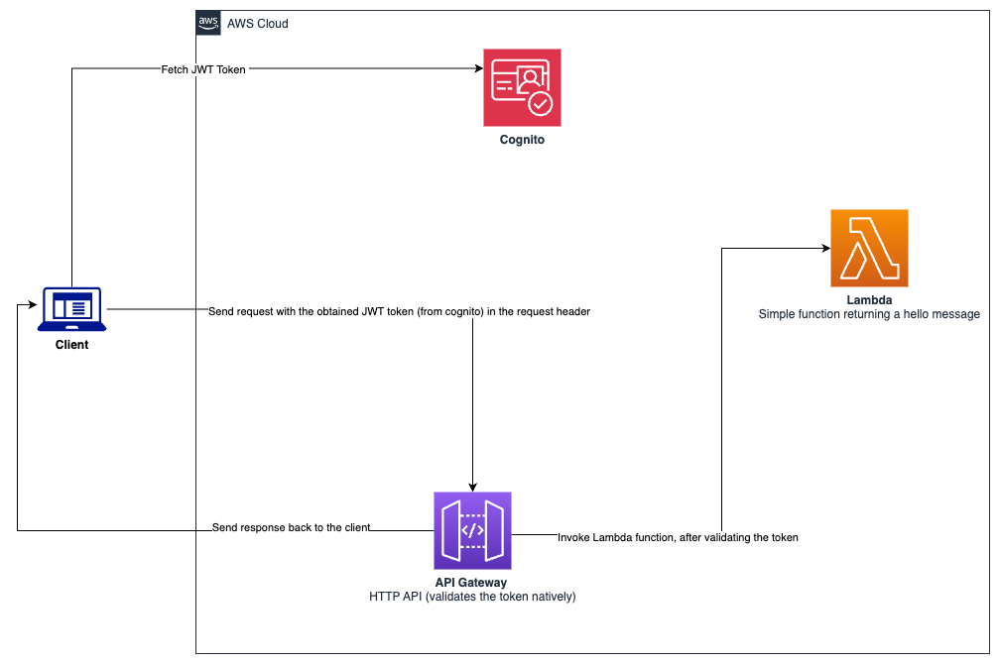

# http-api-gateway-jwt-cognito

This sample shows how to integrate [JWT](https://jwt.io/) token authorization with [Amazon API Gateway](https://aws.amazon.com/api-gateway/) utilizing [AWS CDK](https://aws.amazon.com/cdk/).

The flavor of API used in this sample is the [HTTP API](https://docs.aws.amazon.com/apigateway/latest/developerguide/http-api.html). This natively supports JWT token validation without having to create a separate [authorizer Lambda function](https://docs.aws.amazon.com/apigateway/latest/developerguide/apigateway-use-lambda-authorizer.html).

The token issuing service used in this sample is [Amazon Cognito](https://aws.amazon.com/pm/cognito/).

This solution is native to AWS, and there is no need to set up a separate JWT token issuer/service. Cognito handles User management and the generation of their tokens via [User Pools](https://docs.aws.amazon.com/cognito/latest/developerguide/cognito-user-identity-pools.html).

One caveat of using the HTTP API flavor (of API Gateway) is that it does not natively integrate with [AWS WAF](https://aws.amazon.com/waf/) yet. You need to set up a few more pieces to get that working.

## Architecture



The typical workflow would be that a client application (or a user) would request a JWT token from Cognito using credentials (such as a username and password).

That token would then be supplied in the request header destined for the API Gateway endpoint. Since this sample uses the HTTP API, it can natively validate that token, and forward the request ahead.

API Gateway can integrate with many AWS Services. In this sample, it is connecting to a simple [lambda function](./lambda/lambda_function.py) which returns a simple "Hello" message.

## Seeing it in action

### Pre-requisites

* Since this is a [TypeScript](https://www.typescriptlang.org/) CDK project, you should have [npm](https://www.npmjs.com/) installed (which is the package manager for TypeScript/JavaScript).
    * You can find installation instructions for npm [here](https://docs.npmjs.com/downloading-and-installing-node-js-and-npm).

* Additionally, it would be required for your to have [AWS CLI](https://aws.amazon.com/cli/) installed on your computer.
    *  `pip install awscli`. This means need to have python installed on your computer (if it is not already installed.)
    * You need to also configure and authenticate your AWS CLI to be able to interact with AWS programmatically. Detailed instructions of how you could do that are provided [here](https://docs.aws.amazon.com/cli/latest/userguide/cli-chap-configure.html)

### Install dependencies (if not already done)

```
npm install
```

### Deploy the infrastructure

```
# make sure you are in the root directory of this project

npx cdk deploy HttpApiGatewayJwtCognitoStack

# you can optionally specify the --profile flag to specify a specific non-default AWS profile
```

This will deploy:
* A Cognito User Pool, and an application integration client associated with that user pool
* An API Gateway (HTTP API), and a Lambda function
* Role(s) for API Gateway and Lambda function

The code defining this infrastructure is in the [http-api-gateway-jwt-cognito-stack.ts](./lib/http-api-gateway-jwt-cognito-stack.ts) file in the [lib](./lib/) directory.

The invocation URL for the API can be found in the API Gateway console (specifically in the Stages section). You will need it to test the API request.

### Create a new user in the Cognito user pool

* You can do this in the Cognito console. 

* You can also use the AWS CLI for this. The cognito-idp API reference is [here](https://docs.aws.amazon.com/cli/latest/reference/cognito-idp/). Specific calls are:
    * [admin-create-user](https://docs.aws.amazon.com/cli/latest/reference/cognito-idp/admin-create-user.html)
    * [admin-set-user-password](https://docs.aws.amazon.com/cli/latest/reference/cognito-idp/admin-set-user-password.html)

* There is another utility from aws-samples you can use to ease user creation. It is called [cognito-user-token-helper](https://github.com/aws-samples/cognito-user-token-helper). You can use that script to create a new user by using the `-a create-new-user` flag and supply the `--user-pool-id` with the ID of the User pool that was created as part of the infrastructure deployment. More detailed instructions are provided in that project.

### Obtain a JWT token

After you've created a user in the Cognito User Pool, you can request for a JWT ID token for the API. 

* This can be done programmatically via the AWS CLI. You need to invoke an auth initiation like [admin-initiate-auth](https://docs.aws.amazon.com/cli/latest/reference/cognito-idp/admin-initiate-auth.html). You can obtain the "IdToken" as the JWT token from the response of the API call.

* The [cognito-user-token-helper](https://github.com/aws-samples/cognito-user-token-helper) utility is another option that you can use to obtain a token from cognito. You can use the `-a generate-token` flag, and supply the `--user-pool-id` with the ID of the user pool, and supply the `--client-id` flag with the application integration client ID. Both the User Pool and Application Integration Client are created as part of the infrastructure deployment.

### Test the authorized API endpoint

Once the token is obtained, you can now send a request to the API via [Postman](https://www.postman.com/), [cURL](https://curl.se/), [HTTPie](https://httpie.io/) etc.

The endpoint is a simple `GET` request on the `/hello` route. 

#### Authorized request
The example shown below is using `curl`
```
curl <INVOKE_URL_FROM_API_GATEWAY>/hello -H "Authorization: Bearer <JWT_TOKEN_STRING_GOES_HERE>"
```
If the request was successful, the output should look like:
```
"Hello from Lambda!"
```

#### Unauthorized request
The example shown below is using `curl`
```
curl <INVOKE_URL_FROM_API_GATEWAY>/hello 

# NOTE - the authorization header was not provided in this request
```
The output should look like:
```
{"message":"Unauthorized"}
```

## Generic CDK instructions

This is a blank project for CDK development with TypeScript.

The `cdk.json` file tells the CDK Toolkit how to execute your app.

## Useful commands

* `npm run build`   compile typescript to js
* `npm run watch`   watch for changes and compile
* `npm run test`    perform the jest unit tests
* `cdk deploy`      deploy this stack to your default AWS account/region
* `cdk diff`        compare deployed stack with current state
* `cdk synth`       emits the synthesized CloudFormation template
